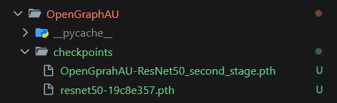

# About
Our project applies a specific algorithm from a [research paper](https://arxiv.org/abs/2205.01782) to predict Facial Action Units (FAUs) [code](https://github.com/CVI-SZU/ME-GraphAU). Although the original paper focuses on still images, we've adapted the algorithm to predict FAUs in videos, analyzing each frame individually for face detection.

For our implementation, we've chosen to use the stage 2 of the ResNet50 architecture. It's important to note that modifying parameters may lead to errors due to the specialized nature of our implementation.

# Demonstration
## Original Video
This video is sourced from the Self-Stimulatory Behavior Dataset (SSBD) [[link](https://ieeexplore.ieee.org/document/6755972)], focusing on autism behavior. Specifically, it depicts a boy doing arm-flapping behavior.


https://github.com/Andreas-UI/ME-GraphAU-Video/assets/51452532/0034e415-edcb-47ff-abe5-6efe91c70093


<video width="320" height="240" controls>
  <source src="videos/v_ArmFlapping_01.mp4" type="video/mp4">
  Your browser does not support the video tag.
</video>

## Output Video
The output video contains the facial action units (FAU) generated by the paper along with a bounding box with emotion on the face. The emotion comes from the FAU combinations in which are most significance with FAU thershold > 0.2.


https://github.com/Andreas-UI/ME-GraphAU-Video/assets/51452532/254fc417-c8b9-468c-8d18-20335474ae33


<video width="320" height="240" controls>
  <source src="videos/demo_v_ArmFlapping_01_output.mp4" type="video/mp4">
  Your browser does not support the video tag.
</video>

# Requirements
Built under python 3.12 
| Python | Status |
| -------- | -------- |
| 3.9 | :x: Fail|
| 3.10 |:white_check_mark: |
| 3.11 | :white_check_mark: |
| 3.11.5 | :white_check_mark: |

# Important
Please install ffmpeg on your machine to use this package. [link](https://www.hostinger.my/tutorials/how-to-install-ffmpeg)

# How to Use
## Checkpoints
Download and insert both of these checkpoints to MEGraphAU > OpenGraphAU > checkpoints.
* resnet50-19c8e357.pth : [link](https://download.pytorch.org/models/resnet50-19c8e357.pth)
* OpenGprahAU-ResNet50_second_stage.pth : [link](https://drive.google.com/file/d/1UMnpbj_YKlqHF1m0DHV0KYD3qmcOmeXp/view?usp=sharing)

Your folder structure should look something like this.<br>


---
Alternatively you may run `python download_checkpoints.py`, if it does not work please proceed downloading the files manually.

## Code
```python
# Import Libraries
import cv2
import ffmpegcv
from MEGraphAU.OpenGraphAU.predict import predict
from MEGraphAU.OpenGraphAU.utils import Image, draw_text
import json
from ultralytics import YOLO

video_path = "videos/v_ArmFlapping_01.mp4"
cap = cv2.VideoCapture(video_path)
fps = cap.get(cv2.CAP_PROP_FPS)

output_frames = []
results = {}

yolo = YOLO("yolov8n-face.pt")

# Read video frame by frame.
while(cap.isOpened()):
    ret, frame = cap.read()

    if ret == True:
        frame_number = cap.get(cv2.CAP_PROP_POS_FRAMES)
        current_time = frame_number / fps

        faces = yolo.predict(frame, conf=0.40, iou=0.3)
        for face in faces:
            parameters = face.boxes

            for box in parameters:
                x1, y1, x2, y2 = box.xyxy[0]
                x1, y1, x2, y2 = int(x1), int(y1), int(x2), int(y2)
                h, w = y2 - y1, x2 - x1
                faces = frame[y1:y1 + h, x1:x1 + w] 

                infostr_aus, pred = predict(Image.fromarray(faces))
                res, f = draw_text(frame, list(infostr_aus), pred, ( (x1, y1), (x1+w, y1+h)))
                results[current_time] = res

                frame = cv2.rectangle(frame, (x1, y1), (x1+w, y1+h), (0, 0, 255), 2) 
        
        output_frames.append(frame)
    
        if cv2.waitKey(25) & 0xFF == ord('q'):
            break
    
    else: 
        break

cap.release()

# OPTIONAL: Save output video
size = output_frames[0].shape
output_video = ffmpegcv.VideoWriter(f"{video_path[:-4]}_output.mp4", None, fps)

for of in output_frames:
    output_video.write(of)
output_video.release()

# OPTIONAL: Save FAU results 
with open(f"{video_path[:-4]}_output.json", 'w') as f:
    json.dump(results, f)

```
🎓 Citation
=
if the code or method help you in the research, please cite the following paper:
```

@inproceedings{luo2022learning,
  title     = {Learning Multi-dimensional Edge Feature-based AU Relation Graph for Facial Action Unit Recognition},
  author    = {Luo, Cheng and Song, Siyang and Xie, Weicheng and Shen, Linlin and Gunes, Hatice},
  booktitle = {Proceedings of the Thirty-First International Joint Conference on
               Artificial Intelligence, {IJCAI-22}},
  pages     = {1239--1246},
  year      = {2022}
}


@article{song2022gratis,
    title={Gratis: Deep learning graph representation with task-specific topology and multi-dimensional edge features},
    author={Song, Siyang and Song, Yuxin and Luo, Cheng and Song, Zhiyuan and Kuzucu, Selim and Jia, Xi and Guo, Zhijiang and Xie, Weicheng and Shen, Linlin and Gunes, Hatice},
    journal={arXiv preprint arXiv:2211.12482},
    year={2022}
}


```
